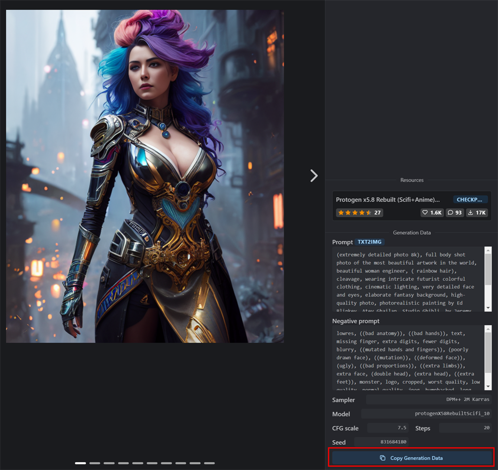
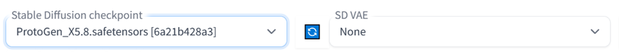
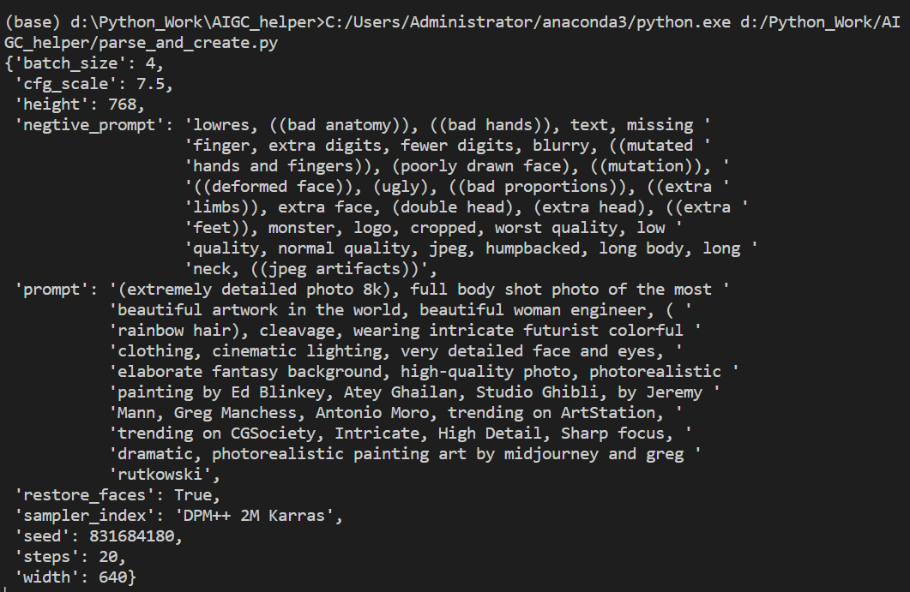

# AIGC_helper
AI绘画辅助脚本，包括：
1. 自动解析从Civitai网站例图拷贝的生成参数，或者是从本地图片读取生成参数信息，再通过SD WebUI的API重新生成图像；这样相比手工逐项拷贝并填写生成参数，大大提升操作效率；
2. 对指定目录下文件按生成模型自动分类归档；
3. 对指定目录下文件清除SD WebUI生成图像时自动添加的生成参数信息，避免prompt等意外泄漏；
4. 批量处理图像tag，如批量增加或去除某个tag、统计tag频次信息等；

## 操作步骤

1. 在Civitai网站拷贝例图生成参数（或者拷贝已下载到本地的文件路径）；
    

2. 在SD WebUI选择合适的模型；

   

3. 运行脚本（parse_and_create.py），调用API生成图像，并保存到本地；

   

   

## 脚本说明

- **parse_and_create.py:** 解析Civitai网站例图生成参数，或者从现有图片文件读取生成参数，并调用SD WebUI的API作画
- **training_helper.py:** 模型训练辅助脚本，批量增删标签、统计标签频次
- **create_with_webuiapi.py:** 使用webuiapi库调用API作画
